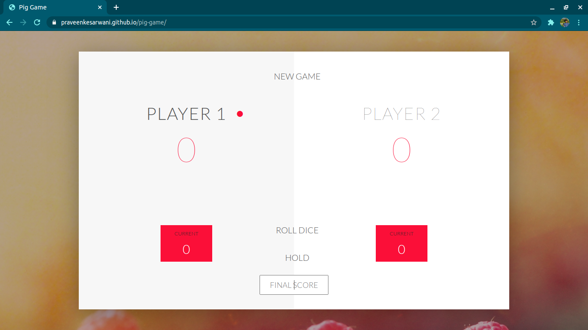

# pig-game
GAME RULES:

- The game has 2 players, playing in rounds
- In each turn, a player rolls a dice as many times as he whishes. Each result get added to his ROUND score
- BUT, if the player rolls a 1, all his ROUND score gets lost. After that, it's the next player's turn
- The player can choose to 'Hold', which means that his ROUND score gets added to his GLBAL score. After that, it's the next player's turn
- The first player to reach 100 points on GLOBAL score wins the game

Changes in Game Rules:

2. Added an input field where players can set the winning score, so that they can change the predefined 
score of 100.
3. Added another dice to the game, so that there are two dices now. The player looses his current score when one of them is a 1.

<a href = "https://praveenkesarwani.github.io/pig-game"> Play Game</a>

